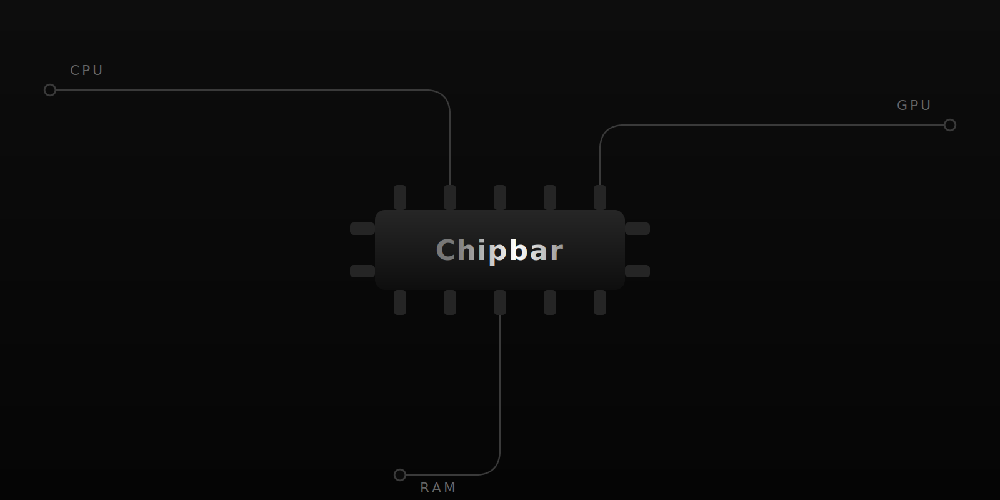
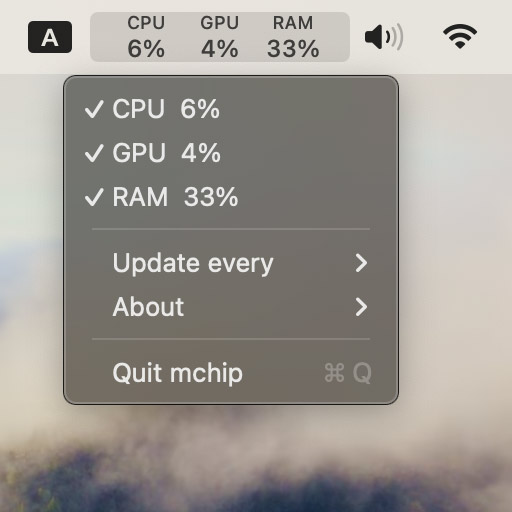

<p align="center">
  
</p>

# Chipbar

Chipbar - is a tiny macos monitor of apple silicon chip process

## Design
```md
CPU  GPU  RAM
 4%  20%  25%
```

<p align="center">
  
</p>

## Install

You can install it from my homebrew tap
```zsh
brew tap ihororlovskyi/tap
brew install --cask chipbar
```
Or you can download the latest release manually:
1. Download and extract the zip file from the latest GitHub release.
2. Drag `Chipbar.app` into your computer’s Applications folder.
3. Within the Applications folder, right-click the app, then select “Open” from the menu that pops up.

## Update

```zsh
brew update
brew upgrade --cask chipbar
```

## Uninstall

```zsh
brew uninstall --cask chipbar
```

See [CHANGELOG.md](CHANGELOG.md) for release notes and [ROADMAP.md](ROADMAP.md) for upcoming work.

Have fun ;)
